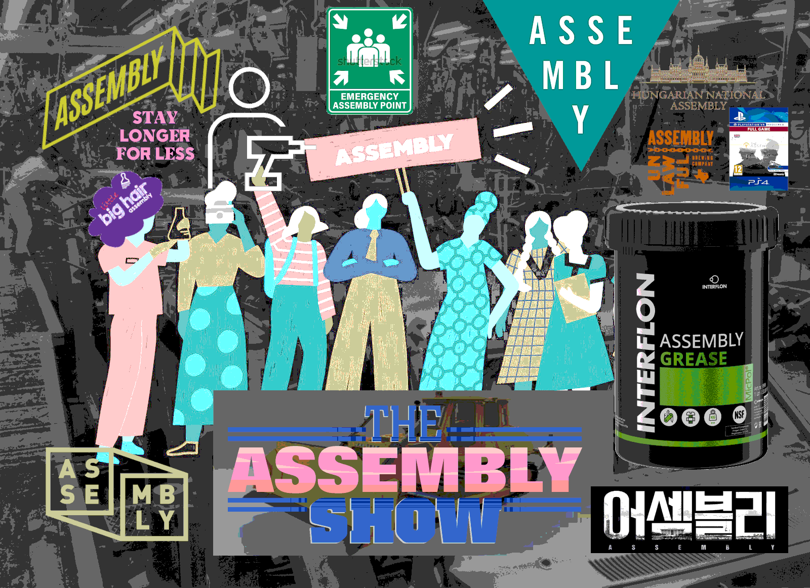
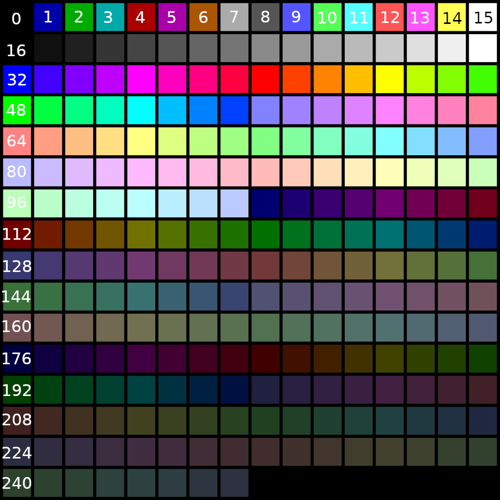

# Archi Helper
Fontosabb assembly(masm) utasítások és Dosbox környezet megfelelő beállítása.

## Jelek értelmezése az "ArchiHelper.txt" állományban:

|Jelölés|Mit jelent|Példa:|
|----|----|----|
|3 sor '#'|Nagyobb témák elválasztása.|-|
|1 sor '#'|Egy nagy témát több kisebb alrészre bont.|-|
|Szöveg/szám '*' között|Gyors elérés, témák száma, neve. Ezekre ha rákeresünk egyből az adott témához ugorhatunk.|\*4.5\* - \*shr\*|
|Egy sor '='|Elválasztó jel, 2 ilyen sor között programkód található.|-|
|{SZOVEG}|Behelyettesítendő szöveg.|shr {MIT},{MENNYIVEL}|
|...|Nem lényeges kód sorok, ez akár több sort is reprezentálhat, de nem lényeges a bemutató szempontjából.|...|
|!!! {SZÖVEG} !!!|Fontos dolog.| !!! Ez egy nagyon fontos szöveg !!! ||

## Témák gyors elérése:
### Használata:
Az "ArchiHelper.txt" állományban keressünk rá az adott számú elem számára vagy nevére. **Ha egy nagyobb téma van akkor a téma elején lehetnek összefoglaló információk amik az egész témára és azok alrészeire is vonatkoznak**

Pl.: Kíváncsiak vagyunk hogy hogyan néz ki a program váza: 
    keresés szövege: "\*2\*" vagy "\*program váz\*" vagy "\*2\* - \*program váz\*"

1. exe létrehozása
1. program váz
1. műveletek
    1. mov
    1. add
    1. sub
    1. cmp
    1. jmp
    1. jz
    1. jnz
    1. jc
    1. jnc
    1. többi jump
    1. loop
    1. offset
    1. kapcsos zárójel - []
    1. push/pop
    1. mul
    1. div
1. bináris műveletek
    1. and
    1. or
    1. xor
    1. shl
    1. shr
    1. rol
    1. ror
1. konzol kezelés
    1. képernyő törlés
    1. kurzor pozícionálása
    1. karakter bevitel
    1. karakter kiíratás
    1. szöveg kiíratás
    1. karakterre várás program feltartása nélkül
1. számlálás
    1. óra beolvasása
    1. eltelt idő számítása
1. gyakori feladatok
    1. karakteres alakzat kirajzolása
    1. karakter számolás egy szövegben
    1. szöveg megfordítása
    1. szövegben lévő egyenelt megoldása
1. egyéb műveletek
    1. paraméterek kezelése
1. grafikus műveletek
    1. grafikus módba váltás
    1. pixel rajzolása
    1. pixel színe
    1. vonalak húzása
    1. alakzatok kitöltése
    1. grafikus módban billentyű leütések észlelése

## Dosbox

### Programok futtatása

1. Hozzunk létre egy mappát a számítógépünkön amiben majd a programunkat fogjuk elkészíteni, ebben a mappában előnyös ha benne van a **masm.exe** és a **link.exe**.
1. Hozzunk létre egy programot **.asm** kiterjesztéssel a mappában.
1. Nyissuk meg a Dosboxot.
1. írjuk be a következőt: **<code>mount c {mappánk elérési utvonala}</code>**
1. Váltsunk a felcsatolt mappába: **<code>C:</code>**
1. (Opcionális) Győződjünk meg hogy az adott fájljaink a mappában vannak-e: **<code>dir</code>**
1. EXE létrehozása Dosboxban: **<code>masm.exe program.asm,,,,</code>** majd **<code>link.exe program.obj,,,,</code>**
1. EXE futtatása: **<code>program.exe</code>**

A megosztott mappában tudunk tovább dolgozni, **Fájlok módosítása esetén nem kell újra felcsatolni viszont, ha új fájlt hozunk létre akkor kell csak újra felcsatolni mount-al**!

### Könyvtárak autómatikus csatolása

1. Keressük meg a **dosbox.conf** fájlunkat (Windows: **<code>{MEGHAJTÓ}:\Users\{FELHASZNÁLÓNÉV}\AppData\Local\DOSBox\dosbox-{VERZIÓSZÁM}.conf</code>**, Linux: **<code>~/.dosbox/</code>**:, Mac OS X: **<code>~/Library/Preferences/DOSBox {VERZIÓSZÁM} Preferences/</code>**)
1. Végére írjuk a következőt: Több mappa autómatikus felcsatolása esetén többször egymás után írjuk a következő sort a megfelelő módosításokkal:**<code>mount c {VALAMILYEN MAPPA AMIT FEL SZERETNÉNK CSATOLNI}</code>** **!!! Több mappa esetén ügyeljünk a meghajtók betűjelére !!!**
1. (OPCIONÁLIS) Ha szeretnénk akkor autómatikusan a felcsatolt meghajtóba válthatunk: **<code>c:</code>**

## Grafikus módban a színek:

A paletta a bal felső saroktól kezdődik, és jobbra haladva egyessével növekedik. Ha egy sornak vége akkor a következő sor elejéről folytatódik tovább a számozás.

A sorok számozása 16-al növekszik. Első sor 0-val kezdődik, 1.sor első elem kódja 16.
